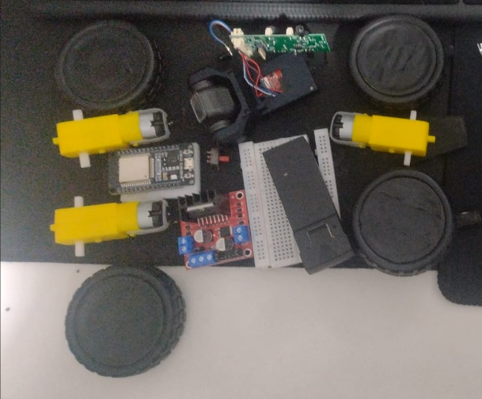
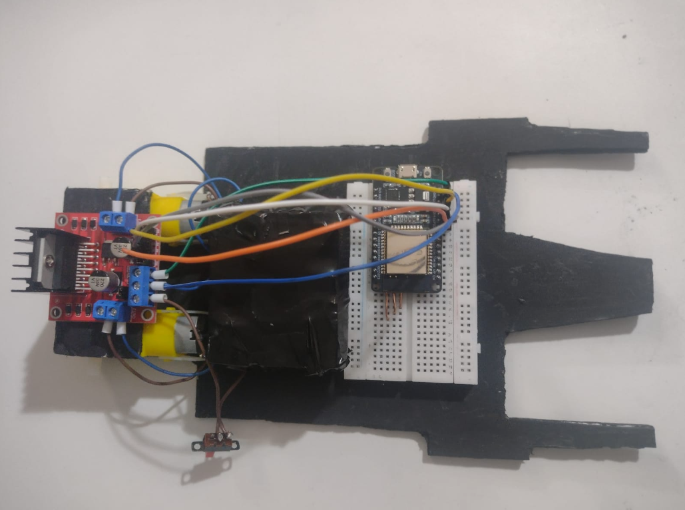
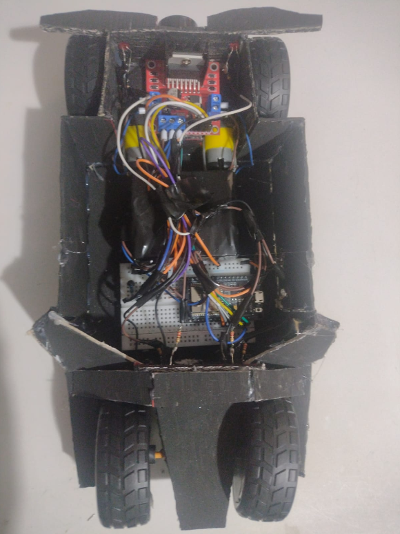
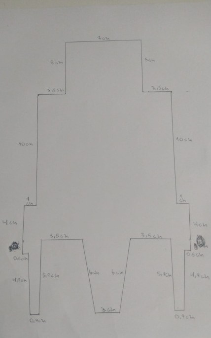
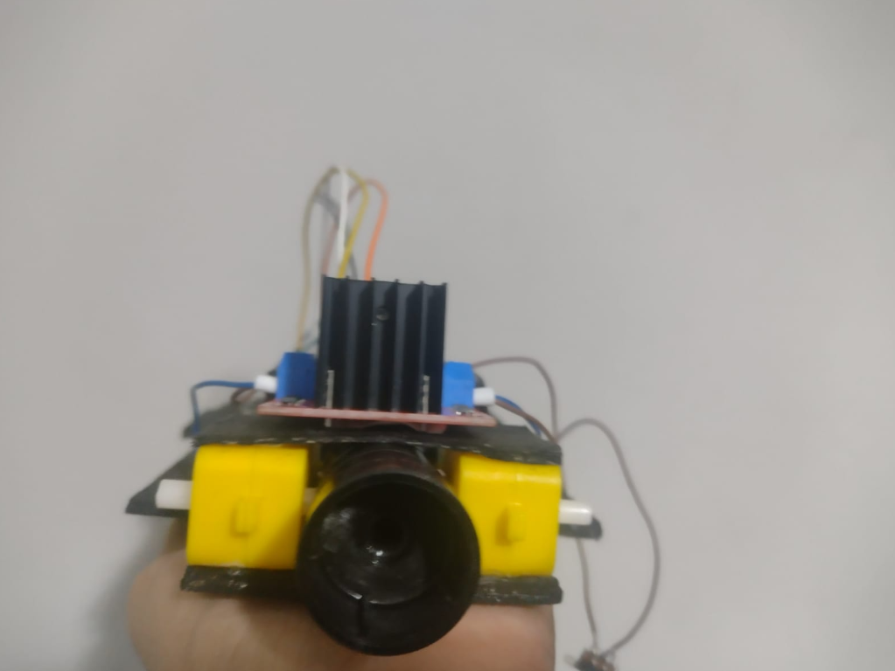
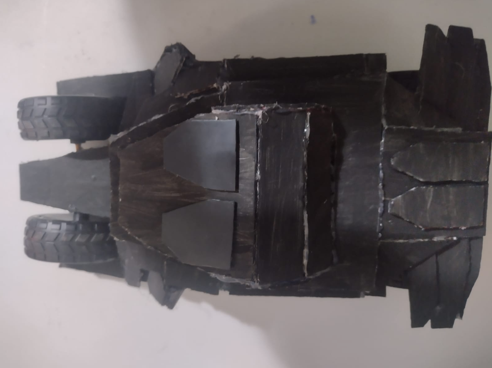

# 🦇 Batmobile Tumbler - Custom Chassis & ESP32 Setup

> Projeto de robótica inspirado no Batmóvel Tumbler com chassi personalizado do zero, controlado por ESP32 e programado em C++.

---

## 🎬 Demonstração em Vídeo

🎥 **[Clique aqui para assistir ao vídeo do Batmóvel Tumbler em ação no LinkedIn!](https://www.linkedin.com/posts/daniel-aires-netto-4034b13bb_robotica-esp32-hardware-ugcPost-7488655839403188224-SiBG/?utm_source=share&utm_medium=member_desktop&rcm=ACoAAGZpJAMBhZsb8GDuzQAxA3AAF9nmbmncuFY)**

---

## 🛠️ Materiais & Componentes

Relação dos componentes utilizados no projeto:

* Microcontrolador ESP32
* Driver de Motor Ponte H
* Motores DC com caixa de redução
* Faróis LED e Câmera integrada
* Estrutura e conectores diversos

---

## 🔌 Esquemáticos & Circuito Eletrônico

### 1. Esquemático Elétrico (EasyEDA)
O esquemático elétrico completo com todas as conexões e pinagens está disponível em PNG na raiz deste repositório:  
📄 **[Ver Esquemático em PNG](Schematic_Batmóvel-Tumbler-Setup.PNG)**

### 2. Montagem do Circuito

| Cabeamento Inicial | Circuito Finalizado |
| :---: | :---: |
|  |  |

---

## 🏎️ Chassi Customizado & Carro Finalizado

Construção do chassi sob medida e montagem final do Tumbler:

| Chassi & Medidas | Detalhe do Canhão |
| :---: | :---: |
|  |  |

### 🦇 Resultado Final

---

## 👨‍💻 Desenvolvedor

Desenvolvido por **Daniel Aires Netto** 🚀  
💼 **[Conecte-se comigo no LinkedIn](https://www.linkedin.com/in/daniel-aires-netto-4034b13bb?utm_source=share_via&utm_content=profile&utm_medium=member_android)**
